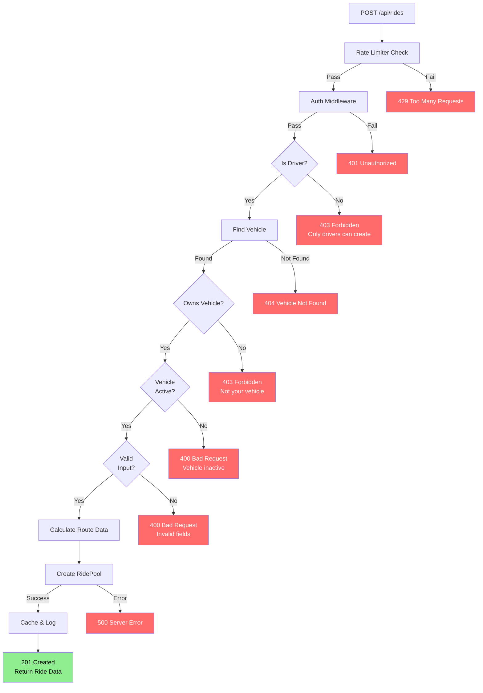
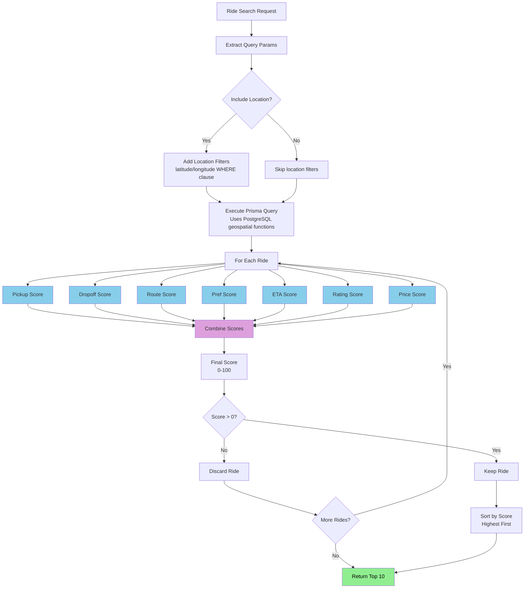
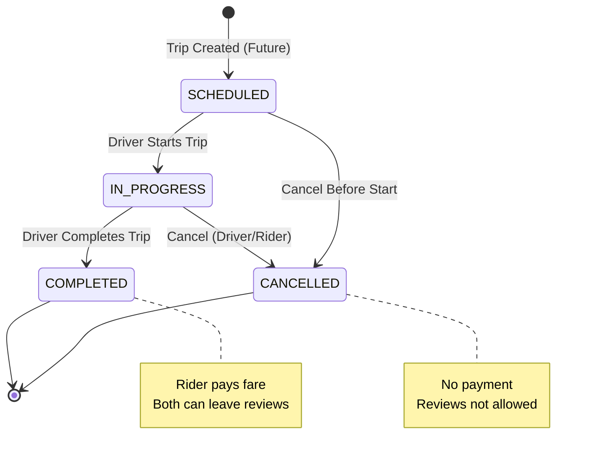

# Carpooling System - Complete Workflow Documentation

> **A comprehensive guide for beginners, developers, and technical leads explaining how code flows through the entire system**

---

## Table of Contents

1. [Introduction](#1-introduction)
2. [System Architecture](#2-system-architecture)
3. [Code Execution Flows](#3-code-execution-flows)
4. [Error Handling](#4-error-handling)
5. [Checkpoint Matrix](#5-checkpoint-matrix)
6. [Quick Reference](#6-quick-reference)

---

# 1. INTRODUCTION

## 1.1 What is Code Flow?

### For Beginners

Code flow is like a **recipe** for making a dish. Just like you follow steps (add flour, then sugar, then mix), our code follows steps to complete tasks.

### For Developers

Code flow documents the **execution path** through our Node.js application, showing exactly which files are called and in what order.

### For Technical Leads

Code flow helps understand **system dependencies**, identify bottlenecks, and plan optimizations.

## 1.2 How This Document is Organized

> Each section contains:
>
> - File execution path (which files are called)
> - Step-by-step process (what happens at each step)
> - Checkpoints (validation points)
> - Error handling (what can go wrong)
> - Happy path diagrams (ASCII + Mermaid)
> - Base cases (all possible outcomes)

---

# 2. SYSTEM ARCHITECTURE

## 2.1 Complete Request-Response Flow

### ASCII Diagram

```
┌───────────────────────────────────────────────────────────────────────────┐
│                        COMPLETE REQUEST-RESPONSE FLOW                     │
├───────────────────────────────────────────────────────────────────────────┤
│                                                                           │
│   HTTP REQUEST                                                            │
│       │                                                                   │
│       ▼                                                                   │
│   ┌──────────────────────────────────────────────────────────────────┐    │
│   │                      EXPRESS SERVER                              │    │
│   │   ┌─────────────┐   ┌─────────┐   ┌──────────────┐               │    │
│   │   │JSON Parser  │──►│  CORS   │──►│Rate Limiter  │               │    │
│   │   └─────────────┘   └─────────┘   └──────┬───────┘               │    │
│   └──────────────────────────────────────────┼───────────────────────┘    │
│                                              │                            │
│                                              ▼                            │
│   ┌──────────────────────────────────────────────────────────────────┐    │
│   │                         ROUTES LAYER                             │    │
│   │   /api/v1/auth/*  ──►  /api/v1/rides/*  ──►  /api/v1/trips/*  ──►│    |
│   └──────────────────────────────────────────────────────────────────┘    │
│                                              │                            │
│                                              ▼                            │
│   ┌───────────────────────────────────────────────────────────────────┐   │
│   │                      MIDDLEWARE LAYER                             │   │
│   │   ┌─────────────────┐     ┌─────────────────┐     ┌─────────────┐ │   │
│   │   │   Auth Check    │────►│   Role Check    │────►│ Validation  │ │   │
│   │   │  (JWT Verify)   │     │  (if required)  │     │   (Joi)     │ │   │
│   │   └────────┬────────┘     └────────┬────────┘     └──────┬──────┘ │   │
│   └───────────┼────────────────────────┼─────────────────────┼────────┘   │
│               │                        │                     │            │
│               │         ┌──────────────┴─────────────────────┘            │
│               │         │                                                 │
│               ▼         ▼                                                 │
│   ┌─────────────────────────────┐    ┌────────────────────────────┐       │
│   │     PASS (next())           │    │      FAIL (next(err))      │       │
│   │     Continue to             │    │      Go to Error Handler   │       │
│   │     Controller              │    │                            │       │
│   └─────────────┬───────────────┘    └──────────────┬─────────────┘       │
│                 │                                   │                     │
│                 └──────────────────┬────────────────┘                     │
│                                    ▼                                      │
│   ┌──────────────────────────────────────────────────────────────────┐    │
│   │                       CONTROLLER LAYER                           │    │
│   │   1. Extract Input   2. Validate   3. Call Service   4. Format   │    │
│   └──────────────────────────────────────────────────────────────────┘    │
│                                    │                                      │
│                                    ▼                                      │
│   ┌──────────────────────────────────────────────────────────────────┐    │
│   │                       SERVICE LAYER                              │    │
│   │   1. Business Logic   2. Data Processing   3. Repository Calls   │    │
│   └──────────────────────────────────────────────────────────────────┘    │
│                                    │                                      │
│                                    ▼                                      │
│   ┌──────────────────────────────────────────────────────────────────┐    │
│   │                     REPOSITORY LAYER                             │    │
│   │   1. Database Queries   2. Data Mapping   3. Transactions        │    │
│   └──────────────────────────────────────────────────────────────────┘    │
│                                    │                                      │
│              ┌─────────────────────┼─────────────────────┐                │
│              │                     │                     │                │
│              ▼                     ▼                     ▼                │
│   ┌─────────────────┐  ┌─────────────────────┐  ┌─────────────────┐           │
│   │  UTILITIES      │  │  POSTGRESQL (Neon)  │  │     REDIS       │           │
│   │ • Distance      │  │  • Prisma Client    │  │  • cache()      │           │
│   │ • Route Matcher │  │  • Repositories     │  │  • get()        │           │
│   │ • S2 Cells      │  │  • Transactions     │  │  • delete()     │           │
│   │ • ETA Calc      │  │                     │  │                 │           │
│   └─────────────────┘  └──────────┬──────────┘  └─────────────────┘           │
│                                 │                                         │
│                                 └─────────────────────────────────────────┤
│                                              │                            │
│                                              ▼                            │
│   ┌──────────────────────────────────────────────────────────────────┐    │
│   │                       RESPONSE LAYER                             │    │
│   │   Success: { success: true, data: {...} }                        │    │
│   │   Error:   { success: false, error: {...} }                      │    │
│   └──────────────────────────────────────────────────────────────────┘    │
│                                                                           │
└───────────────────────────────────────────────────────────────────────────┘
```

### Mermaid Diagram

```mermaid
flowchart TD
    subgraph CLIENT["Client"]
        A[HTTP Request]
    end

    subgraph SERVER["Express Server"]
        B[JSON Parser] --> C[CORS Middleware]
        C --> D[Rate Limiter]
    end

    subgraph ROUTES["Routes Layer"]
        E[Route Matching]
    end

    subgraph MIDDLEWARE["Middleware Layer"]
        F[Auth Check] --> G[Role Check]
        G --> H[Validation (Joi)]
        F --> |Fail| I[Error Handler]
        G --> |Fail| I
        H --> |Invalid| I
    end

    subgraph CONTROLLERS["Controllers Layer"]
        J[Extract Input] --> K[Call Service]
    end

    subgraph SERVICES["Services Layer"]
        L[Business Logic] --> M[Repository Calls]
    end

    subgraph REPOSITORIES["Repository Layer"]
        N[Database Queries]
    end

    subgraph UTILITIES["Utilities"]
        O[Distance Calc]
        P[Route Matcher]
        Q[S2 Cell Manager]
        R[ETA Calculator]
    end

    subgraph DATABASE["Database Layer"]
        S[(PostgreSQL)]
        T[(Redis Cache)]
    end

    A --> B
    D --> E
    E --> F
    H --> |Pass| J
    K --> L
    L --> M
    M --> N
    M --> O & P & Q & R
    N --> S
    N --> T
    S --> RESP[HTTP Response]
    T --> RESP

    style I fill:#ff6b6b,color:#fff
    style RESP fill:#90ee90,color:#000
```

## 2.2 File Structure & Dependencies

```
backend/
├── prisma/
│   └── schema.prisma          # Prisma schema (PostgreSQL models)
│
backend/src/
├── app.js                    # Express app setup
├── server.js                 # Entry point - Server startup
│
├── config/
│   ├── index.js             # Config aggregator
│   ├── app.js               # App configuration
│   ├── database.js          # PostgreSQL (Neon) connection
│   ├── jwt.js               # JWT configuration
│   ├── google.js            # Google OAuth configuration
│   ├── redis.js             # Redis configuration
│   └── rateLimit.js         # Rate limiting configuration
│
├── database/
│   └── connection.js        # Prisma client setup
│
├── constants/
│   └── roles.js             # User roles (DRIVER, RIDER, ADMIN)
│
├── repositories/             # Data Access Layer (DAL)
│   ├── base/
│   │   └── BaseRepository.js  # Generic CRUD operations
│   ├── UserRepository.js
│   ├── VehicleRepository.js
│   ├── RideRepository.js
│   ├── RideRequestRepository.js
│   ├── TripRepository.js
│   ├── MessageRepository.js
│   ├── ReviewRepository.js
│   ├── SOSRepository.js
│   └── index.js
│
├── services/                  # Business Logic Layer
│   ├── base/
│   │   └── BaseService.js     # Generic service methods
│   ├── AuthService.js         # Auth + Google OAuth
│   ├── UserService.js
│   ├── VehicleService.js
│   ├── RideService.js
│   ├── TripService.js
│   ├── MessageService.js
│   ├── ReviewService.js
│   ├── SOSService.js
│   └── index.js
│
├── controllers/              # Request Handlers
│   ├── authController.js
│   ├── userController.js
│   ├── vehicleController.js
│   ├── rideController.js
│   ├── tripController.js
│   ├── messageController.js
│   ├── reviewController.js
│   ├── privacyController.js
│   └── index.js
│
├── routes/                   # Route Definitions
│   ├── v1/
│   │   ├── index.js        # Route aggregator
│   │   ├── auth.routes.js
│   │   ├── users.routes.js
│   │   ├── vehicles.routes.js
│   │   ├── rides.routes.js
│   │   ├── trips.routes.js
│   │   ├── messages.routes.js
│   │   ├── reviews.routes.js
│   │   └── privacy.routes.js
│   └── index.js
│
├── middleware/               # Express Middleware
│   ├── auth.js              # JWT authentication
│   ├── errorHandler.js      # Global error handler
│   ├── logger.js            # Request logging
│   ├── rateLimiter.js       # Rate limiting
│   └── common/              # Validation middleware
│       └── index.js
│
├── validators/               # Joi Validation Schemas
│   ├── auth.validator.js
│   ├── user.validator.js
│   ├── vehicle.validator.js
│   ├── ride.validator.js
│   ├── trip.validator.js
│   ├── message.validator.js
│   ├── review.validator.js
│   └── common.schemas.js
│
├── dto/                      # Data Transfer Objects
│   └── response/
│       └── index.js         # ApiResponse, PaginatedResponse
│
├── exceptions/              # Custom Exceptions
│   ├── index.js
│   ├── NotFoundException.js
│   ├── ConflictException.js
│   ├── ForbiddenException.js
│   ├── BadRequestException.js
│   └── AuthException.js
│
└── utils/                   # Utility Functions
    ├── helpers.js           # General helpers
    ├── distance.js          # Haversine distance calculation
    ├── routeMatcher.js      # Route matching algorithm
    ├── s2Cell.js           # S2 cell geohashing
    ├── eta.js              # ETA calculation
    ├── privacy.js         # Privacy utilities
    └── cache.js            # Redis cache service
```

```
┌─────────────────────────────────────────────────────────────────────────────┐
│ STEP 1: HTTP Request                                                        │
├─────────────────────────────────────────────────────────────────────────────┤
│                                                                             │
│   Client sends request to Express Server                                    │
│                                                                             │
└─────────────────────────────────────────────────────────────────────────────┘
                                    │
                                    ▼
┌─────────────────────────────────────────────────────────────────────────────┐
│ STEP 2: Express Server Middleware                                           │
├─────────────────────────────────────────────────────────────────────────────┤
│                                                                             │
│   ┌─────────────┐     ┌─────────┐     ┌──────────────┐                      │
│   │JSON Parser │────►│  CORS   │────►│Rate Limiter  │                       │
│   └─────────────┘     └─────────┘     └──────┬───────┘                      │
│                                                                             │
└─────────────────────────────────────────────────────────────────────────────┘
                                    │
                                    ▼
┌─────────────────────────────────────────────────────────────────────────────┐
│ STEP 3: Routes Layer                                                        │
├─────────────────────────────────────────────────────────────────────────────┤
│                                                                             │
│   /api/auth/* ──► /api/rides/* ──► /api/trips/* ──► ...                     │
│                                                                             │
└─────────────────────────────────────────────────────────────────────────────┘
                                    │
                                    ▼
┌─────────────────────────────────────────────────────────────────────────────┐
│ STEP 4: Middleware Layer                                                    │
├─────────────────────────────────────────────────────────────────────────────┤
│                                                                             │
│   ┌─────────────────┐     ┌─────────────────┐                               │
│   │   Auth Check    │────►│   Role Check    │                               │
│   │  (JWT Verify)   │     │ (if required)   │                               │
│   └────────┬────────┘     └────────┬────────┘                               │
│                                                                             │
│   ✅ PASS ──► next() ──► Controller                                         │
│   ❌ FAIL ──► next(err) ──► Error Handler                                   │
│                                                                             │
└─────────────────────────────────────────────────────────────────────────────┘
                                    │
                                    ▼
┌─────────────────────────────────────────────────────────────────────────────┐
│ STEP 5: Controller Layer                                                    │
├─────────────────────────────────────────────────────────────────────────────┤
│                                                                             │
│   1. Extract Input   2. Validate   3. Auth Check   4. Business Logic        │
│                                                                             │
└─────────────────────────────────────────────────────────────────────────────┘
                                    │
              ┌─────────────────────┼─────────────────────┐
              │                     │                     │
              ▼                     ▼                     ▼
┌─────────────────────┐ ┌─────────────────────────────┐ ┌─────────────────────┐
│     UTILITIES       │ │   POSTGRESQL (Neon)         │ │       REDIS         │
├─────────────────────┤ ├─────────────────────────────┤ ├─────────────────────┤
│ • Distance Calc     │ │ • Prisma Client             │ │ • cache()           │
│ • Route Matcher     │ │ • Repositories              │ │ • get()             │
│ • S2 Cells          │ │ • Transactions              │ │ • delete()          │
│ • ETA Calculator    │ │                             │ │                     │
└─────────────────────┘ └─────────────────────────────┘ └─────────────────────┘
                                    │
                                    ▼
┌─────────────────────────────────────────────────────────────────────────────┐
│ STEP 6: Response                                                            │
├─────────────────────────────────────────────────────────────────────────────┤
│                                                                             │
│   Success: { status: "success", data: {...} }                               │
│   Error:   { status: "error", message: "..." }                              │
│                                                                             │
└─────────────────────────────────────────────────────────────────────────────┘
```

````

### Mermaid Diagram

```mermaid
flowchart TD
    subgraph CLIENT["Client"]
        A[HTTP Request]
    end

    subgraph SERVER["Express Server"]
        B[JSON Parser] --> C[CORS Middleware]
        C --> D[Rate Limiter]
    end

    subgraph ROUTES["Routes Layer"]
        E[Route Matching]
    end

    subgraph MIDDLEWARE["Middleware Layer"]
        F[Auth Check] --> G[Role Check]
        F --> |Fail| H[Error Handler]
        G --> |Fail| H
    end

    subgraph CONTROLLERS["Controllers Layer"]
        I[Input Validation] --> J[Business Logic]
        I --> |Invalid| H
        J --> K[Data Processing]
    end

    subgraph UTILITIES["Utilities"]
        L[Distance Calc]
        M[Route Matcher]
        N[S2 Cell Manager]
        O[ETA Calculator]
    end

    subgraph DATABASE["Database Layer"]
        P[(PostgreSQL)]
        Q[(Redis Cache)]
    end

    A --> B
    D --> E
    E --> F
    F --> |Pass| I
    G --> |Pass| I
    J --> K
    K --> L & M & N & O
    J --> P
    J --> Q
    P --> RESP[HTTP Response]
    Q --> RESP

    style H fill:#ff6b6b,color:#fff
    style RESP fill:#90ee90,color:#000
````

## 2.2 File Structure & Dependencies

```
backend/
├── prisma/
│   └── schema.prisma          # Prisma schema (PostgreSQL models)

backend/src/
├── index.js                    # Entry point - Express server setup
│
├── config/
│   ├── index.js               # Configuration (env variables)
│   ├── database.js            # PostgreSQL (Neon) connection
│   └── ...
│
├── database/
│   └── connection.js         # Prisma client setup
│
├── routes/                    # Route definitions
│   ├── auth.js              # /api/auth/* routes
│   ├── users.js             # /api/users/* routes
│   ├── vehicles.js          # /api/vehicles/* routes
│   ├── rides.js             # /api/rides/* routes
│   ├── trips.js             # /api/trips/* routes
│   ├── privacy.js           # /api/privacy/* routes
│   ├── reviews.js           # /api/reviews/* routes
│   └── messages.js          # /api/messages/* routes
│
├── controllers/               # Request handlers
│   ├── authController.js
│   ├── userController.js
│   ├── vehicleController.js
│   ├── rideController.js
│   ├── tripController.js
│   ├── privacyController.js
│   ├── reviewController.js
│   └── messageController.js
│
├── middleware/                # Custom middleware
│   ├── auth.js              # JWT authentication
│   ├── errorHandler.js      # Global error handler
│   ├── logger.js            # Logging utility
│   └── rateLimiter.js       # Rate limiting
│
└── utils/                   # Utility functions
    ├── helpers.js           # General helpers
    ├── distance.js          # Haversine distance calculation
    ├── routeMatcher.js      # Route matching algorithm
    ├── s2Cell.js           # S2 cell geohashing
    ├── eta.js              # ETA calculation
    └── privacy.js           # Privacy utilities
```

---

# 3. CODE EXECUTION FLOWS

## 3.1 Authentication Flow

### Registration: `POST /api/auth/register`

#### File Execution Path

```
backend/src/routes/auth.js
         │
         ▼
backend/src/middleware/rateLimiter.js (CHECKPOINT 1)
         │
         ▼
backend/src/controllers/authController.js (register function)
          │
          ├──► backend/src/repositories/UserRepository.js
          │
          └──► PostgreSQL Database (Neon)
```

#### Step-by-Step Execution

| Step | Action                        | Checkpoint                | Success     | Failure         |
| ---- | ----------------------------- | ------------------------- | ----------- | --------------- |
| 1    | Extract input from `req.body` | Required fields present?  | Continue    | 400 Bad Request |
| 2    | Check existing user           | Email unique?             | Continue    | 409 Conflict    |
| 3    | Hash password                 | `bcrypt.hash()`           | Continue    | 500 Error       |
| 4    | Create user                   | `userRepository.create()` | Continue    | 500 Error       |
| 5    | Generate JWT                  | `jwt.sign()`              | Continue    | 500 Error       |
| 6    | Send response                 | `res.json()`              | 201 Created | -               |

#### Code Flow Diagram

```
┌─────────────────────────────────────────────────────────────────────────────┐
│ STEP 1: Extract Input                                                       │
├─────────────────────────────────────────────────────────────────────────────┤
│                                                                             │
│   const { email, password, firstName, lastName, phone, role } = req.body;   │
│                                                                             │
│   ✅ Required fields present? ──► Continue                                  │
│   ❌ Missing field ──► 400 Bad Request                                      │
│                                                                             │
└─────────────────────────────────────────────────────────────────────────────┘
                                    │
                                    ▼
┌─────────────────────────────────────────────────────────────────────────────┐
│ STEP 2: Check Existing User                                                 │
├─────────────────────────────────────────────────────────────────────────────┤
│                                                                             │
│   const existingUser = await userRepository.findByEmail(email);             │
│                                                                             │
│   ❌ User exists ──► 409 Conflict ("Email already registered")              │
│   ✅ Not exists ──► Continue                                                │
│                                                                             │
└─────────────────────────────────────────────────────────────────────────────┘
                                    │
                                    ▼
┌─────────────────────────────────────────────────────────────────────────────┐
│ STEP 3: Hash Password                                                       │
├─────────────────────────────────────────────────────────────────────────────┤
│                                                                             │
│   const hashedPassword = await bcrypt.hash(password, 10);                   │
│   // Uses bcrypt with 10 salt rounds                                        │
│   // Takes ~100ms to hash                                                   │
│                                                                             │
│   ❌ Hash failed ──► 500 Internal Server Error                              │
│   ✅ Success ──► Continue                                                   │
│                                                                             │
└─────────────────────────────────────────────────────────────────────────────┘
                                    │
                                    ▼
┌─────────────────────────────────────────────────────────────────────────────┐
│ STEP 4: Create User                                                         │
├─────────────────────────────────────────────────────────────────────────────┤
│                                                                             │
│   const user = await userRepository.create({                                │
│     email,                                                                  │
│     password: hashedPassword,                                               │
│     firstName,                                                              │
│     lastName,                                                               │
│     phone,                                                                  │
│     role: role || 'RIDER',                                                  │
│     rating: 0,                                                              │
│     isActive: true                                                          │
│   });                                                                       │
│                                                                             │
│   ❌ Creation failed ──► 500 Internal Server Error                          │
│   ✅ Success ──► Continue                                                   │
│                                                                             │
└─────────────────────────────────────────────────────────────────────────────┘
                                    │
                                    ▼
┌─────────────────────────────────────────────────────────────────────────────┐
│ STEP 5: Generate JWT Token                                                  │
├─────────────────────────────────────────────────────────────────────────────┤
│                                                                             │
│   const token = jwt.sign(                                                   │
│     { userId: user.id, role: user.role },                                   │
│     config.JWT_SECRET,                                                      │
│     { expiresIn: '7d' }                                                     │
│   );                                                                        │
│                                                                             │
│   // Token contains: userId, role, iat (issued at), exp (expires)           │
│   // Valid for 7 days                                                       │
│                                                                             │
└─────────────────────────────────────────────────────────────────────────────┘
                                    │
                                    ▼
┌─────────────────────────────────────────────────────────────────────────────┐
│ STEP 6: Send Response                                                       │
├─────────────────────────────────────────────────────────────────────────────┤
│                                                                             │
│   res.status(201).json({                                                    │
│     status: 'success',                                                      │
│     data: {                                                                 │
│       user: { id, email, firstName, role },                                 │
│       token                                                                 │
│     }                                                                       │
│   });                                                                       │
│                                                                             │
└─────────────────────────────────────────────────────────────────────────────┘
```

### Base Cases Summary

| Scenario             | HTTP Code             | Response                     |
| -------------------- | --------------------- | ---------------------------- |
| Valid registration   | 201 Created           | `{ user, token }`            |
| Missing email        | 400 Bad Request       | `"Please provide all..."`    |
| Missing password     | 400 Bad Request       | `"Please provide all..."`    |
| Email already exists | 409 Conflict          | `"Email already registered"` |
| Rate limit exceeded  | 429 Too Many Requests | `"Too many requests..."`     |
| Server error         | 500 Internal Error    | Error passed to handler      |

---

### Login: `POST /api/auth/login`

#### Step-by-Step Execution

| Step | Action          | Checkpoint         | Success  | Failure          |
| ---- | --------------- | ------------------ | -------- | ---------------- |
| 1    | Extract input   | Fields present?    | Continue | 400 Bad Request  |
| 2    | Find user       | User exists?       | Continue | 401 Unauthorized |
| 3    | Check active    | User isActive?     | Continue | 401 Unauthorized |
| 4    | Verify password | `bcrypt.compare()` | Continue | 401 Unauthorized |
| 5    | Generate token  | `jwt.sign()`       | Continue | 500 Error        |
| 6    | Send response   | `res.json()`       | 200 OK   | -                |

#### Code Flow Diagram

```
┌─────────────────────────────────────────────────────────────────────────────┐
│ CHECKPOINT 1: Fields Present                                                │
├─────────────────────────────────────────────────────────────────────────────┤
│                                                                             │
│   if (!email || !password)                                                  │
│     → 400 Bad Request                                                       │
│                                                                             │
│   ✅ Continue if both present                                               │
│                                                                             │
└─────────────────────────────────────────────────────────────────────────────┘
                                    │
                                    ▼
┌─────────────────────────────────────────────────────────────────────────────┐
│ CHECKPOINT 2: User Exists                                                   │
├─────────────────────────────────────────────────────────────────────────────┤
│                                                                             │
│   const user = await userRepository.findByEmail(email);                     │
│                                                                             │
│   if (!user)                                                                │
│     → 401 Unauthorized ("Invalid credentials")                              │
│                                                                             │
│   ✅ Continue if user found                                                │
│                                                                             │
└─────────────────────────────────────────────────────────────────────────────┘
                                    │
                                    ▼
┌─────────────────────────────────────────────────────────────────────────────┐
│ CHECKPOINT 3: User Active                                                   │
├─────────────────────────────────────────────────────────────────────────────┤
│                                                                             │
│   if (!user.isActive)                                                       │
│     → 401 Unauthorized ("Account deactivated")                              │
│                                                                             │
│   ✅ Continue if user is active                                             │
│                                                                             │
└─────────────────────────────────────────────────────────────────────────────┘
                                    │
                                    ▼
┌─────────────────────────────────────────────────────────────────────────────┐
│ CHECKPOINT 4: Password Correct                                              │
├─────────────────────────────────────────────────────────────────────────────┤
│                                                                             │
│   const isMatch = await bcrypt.compare(password, user.password);            │
│   // bcrypt.compare takes ~50ms                                             │
│                                                                             │
│   if (!isMatch)                                                             │
│     → 401 Unauthorized ("Invalid credentials")                              │
│                                                                             │
│   ✅ Continue if password matches                                           │
│                                                                             │
└─────────────────────────────────────────────────────────────────────────────┘
```

---

### Google Sign-In: `GET /api/v1/auth/google`

Initiate Google OAuth flow for web applications.

#### Step-by-Step Execution

| Step | Action       | Checkpoint          | Success  | Failure   |
| ---- | ------------ | ------------------- | -------- | --------- |
| 1    | Generate URL | Google config valid | Continue | 500 Error |
| 2    | Redirect     | Auth URL created    | 302      | -         |

#### Code Flow Diagram

```
┌─────────────────────────────────────────────────────────────────────────────┐
│ STEP 1: Generate Google OAuth URL                                           │
├─────────────────────────────────────────────────────────────────────────────┤
│                                                                             │
│   const authUrl = googleAuth.getAuthUrl();                                  │
│   // Returns: https://accounts.google.com/o/oauth2/v2/auth?                 │
│   //   client_id=xxx&                                                       │
│   //   redirect_uri=xxx&                                                    │
│   //   response_type=code&                                                  │
│   //   scope=openid%20email%20profile                                       │
│                                                                             │
│   ✅ Continue ──► Redirect to Google                                        │
│                                                                             │
└─────────────────────────────────────────────────────────────────────────────┘
                                     │
                                     ▼
┌─────────────────────────────────────────────────────────────────────────────┐
│ STEP 2: Redirect to Google                                                  │
├─────────────────────────────────────────────────────────────────────────────┤
│                                                                             │
│   res.redirect(authUrl);                                                    │
│                                                                             │
│   User completes Google login ──► Google redirects to callback URL          │
│                                                                             │
└─────────────────────────────────────────────────────────────────────────────┘
```

---

### Google Sign-In Callback: `GET /api/v1/auth/google/callback`

Handle Google OAuth callback.

#### Step-by-Step Execution

| Step | Action           | Checkpoint     | Success  | Failure   |
| ---- | ---------------- | -------------- | -------- | --------- |
| 1    | Exchange code    | Code valid     | Continue | 401 Error |
| 2    | Verify token     | Token valid    | Continue | 401 Error |
| 3    | Find/create user | User processed | Continue | 500 Error |
| 4    | Generate JWT     | Token created  | Continue | 500 Error |
| 5    | Send response    | Response sent  | 200/201  | -         |

#### Code Flow Diagram

```
┌─────────────────────────────────────────────────────────────────────────────┐
│ CHECKPOINT 1: Exchange Code for Tokens                                      │
├─────────────────────────────────────────────────────────────────────────────┤
│                                                                             │
│   const { tokens } = await googleAuth.getTokenFromCode(code);               │
│                                                                             │
│   ❌ Failed ──► 401 "Google authentication failed"                          │
│   ✅ Success ──► Continue                                                   │
│                                                                             │
└─────────────────────────────────────────────────────────────────────────────┘
                                     │
                                     ▼
┌─────────────────────────────────────────────────────────────────────────────┐
│ CHECKPOINT 2: Verify Google Token                                           │
├─────────────────────────────────────────────────────────────────────────────┤
│                                                                             │
│   const payload = await googleAuth.verifyIdToken(tokens.id_token);          │
│   const { email, given_name, family_name, email_verified } = payload;       │
│                                                                             │
│   ❌ Invalid ──► 401 "Invalid Google token"                                 │
│   ✅ Valid ──► Continue                                                     │
│                                                                             │
└─────────────────────────────────────────────────────────────────────────────┘
                                     │
                                     ▼
┌─────────────────────────────────────────────────────────────────────────────┐
│ CHECKPOINT 3: Find or Create User                                           │
├─────────────────────────────────────────────────────────────────────────────┤
│                                                                             │
│   let user = await userRepository.findByEmail(email);                       │
│                                                                             │
│   if (!user) {                                                              │
│     // NEW USER: Create Google account                                      │
│     user = await userRepository.create({                                    │
│       email,                                                                │
│       firstName: given_name || 'User',                                      │
│       lastName: family_name || '',                                          │
│       isGoogleUser: true,                                                   │
│       emailVerified: email_verified,                                        │
│       googleId: payload.sub                                                 │
│     });                                                                     │
│   } else {                                                                  │
│     // EXISTING USER: Update Google info if not already linked              │
│     if (!user.googleId) {                                                   │
│       user = await userRepository.update(user.id, {                         │
│         googleId: payload.sub,                                              │
│         isGoogleUser: true                                                  │
│       });                                                                   │
│     }                                                                       │
│   }                                                                         │
│                                                                             │
└─────────────────────────────────────────────────────────────────────────────┘
                                     │
                                     ▼
┌─────────────────────────────────────────────────────────────────────────────┐
│ STEP 4: Generate JWT & Respond                                              │
├─────────────────────────────────────────────────────────────────────────────┤
│                                                                             │
│   const token = jwt.sign({ userId: user.id }, config.JWT_SECRET, {          │
│     expiresIn: '7d'                                                         │
│   });                                                                       │
│                                                                             │
│   res.status(isNewUser ? 201 : 200).json({                                  │
│     success: true,                                                          │
│     message: isNewUser ? 'Account created with Google' : undefined,         │
│     data: { user, token, isNewUser }                                        │
│   });                                                                       │
│                                                                             │
└─────────────────────────────────────────────────────────────────────────────┘
```

---

### Mobile Google Sign-In: `POST /api/v1/auth/google/mobile`

Google Sign-In for mobile apps (direct token exchange).

#### Step-by-Step Execution

| Step | Action              | Checkpoint     | Success  | Failure   |
| ---- | ------------------- | -------------- | -------- | --------- |
| 1    | Validate request    | Token provided | Continue | 400 Error |
| 2    | Verify Google token | Token valid    | Continue | 401 Error |
| 3    | Find/create user    | User processed | Continue | 500 Error |
| 4    | Generate JWT        | Token created  | Continue | 500 Error |
| 5    | Send response       | Response sent  | 200/201  | -         |

#### Code Flow Diagram

```
┌─────────────────────────────────────────────────────────────────────────────┐
│ CHECKPOINT 1: Validate Request                                              │
├─────────────────────────────────────────────────────────────────────────────┤
│                                                                             │
│   const { idToken } = req.body;                                             │
│                                                                             │
│   if (!idToken)                                                             │
│     → 400 Bad Request ("Google ID token required")                          │
│                                                                             │
│   ✅ Token provided ──► Continue                                            │
│                                                                             │
└─────────────────────────────────────────────────────────────────────────────┘
                                     │
                                     ▼
┌─────────────────────────────────────────────────────────────────────────────┐
│ CHECKPOINT 2: Verify Google ID Token                                        │
├─────────────────────────────────────────────────────────────────────────────┤
│                                                                             │
│   const ticket = await client.verifyIdToken({                               │
│     idToken,                                                                │
│     audience: config.GOOGLE_CLIENT_ID                                       │
│   });                                                                       │
│   const payload = ticket.getPayload();                                      │
│                                                                             │
│   ❌ Failed ──► 401 "Invalid Google token"                                  │
│   ✅ Valid ──► Continue                                                     │
│                                                                             │
└─────────────────────────────────────────────────────────────────────────────┘
                                     │
                                     ▼
┌─────────────────────────────────────────────────────────────────────────────┐
│ CHECKPOINT 3: Find or Create User (Same as callback)                        │
├─────────────────────────────────────────────────────────────────────────────┤
│                                                                             │
│   Same logic as Google Callback endpoint                                    │
│   - Check for existing user by email                                        │
│   - Create new user if not exists                                           │
│   - Link Google account if user exists but not Google user                  │
│                                                                             │
└─────────────────────────────────────────────────────────────────────────────┘
                                     │
                                     ▼
┌─────────────────────────────────────────────────────────────────────────────┐
│ STEP 4: Generate JWT & Respond                                              │
├─────────────────────────────────────────────────────────────────────────────┤
│                                                                             │
│   const token = jwt.sign({ userId: user.id }, config.JWT_SECRET, {          │
│     expiresIn: '7d'                                                         │
│   });                                                                       │
│                                                                             │
│   res.status(isNewUser ? 201 : 200).json({                                  │
│     success: true,                                                          │
│     data: { user, token, isNewUser }                                        │
│   });                                                                       │
│                                                                             │
└─────────────────────────────────────────────────────────────────────────────┘
```

---

### Link Google Account: `POST /api/v1/auth/google/link`

Link Google account to an already logged-in user.

#### Step-by-Step Execution

| Step | Action                   | Checkpoint     | Success  | Failure      |
| ---- | ------------------------ | -------------- | -------- | ------------ |
| 1    | User authenticated       | Auth valid     | Continue | 401 Error    |
| 2    | Validate request         | Token provided | Continue | 400 Error    |
| 3    | Verify Google token      | Token valid    | Continue | 401 Error    |
| 4    | Check not already linked | Not linked     | Continue | 409 Conflict |
| 5    | Link Google account      | Account linked | Continue | 500 Error    |
| 6    | Send response            | Response sent  | 200      | -            |

#### Code Flow Diagram

```
┌─────────────────────────────────────────────────────────────────────────────┐
│ CHECKPOINT 1-2: Auth & Validate                                             │
├─────────────────────────────────────────────────────────────────────────────┤
│                                                                             │
│   // User must be authenticated (req.user from JWT)                         │
│   const { idToken } = req.body;                                             │
│                                                                             │
│   if (!idToken)                                                             │
│     → 400 Bad Request                                                       │
│                                                                             │
│   ✅ Continue                                                               │
│                                                                             │
└─────────────────────────────────────────────────────────────────────────────┘
                                     │
                                     ▼
┌─────────────────────────────────────────────────────────────────────────────┐
│ CHECKPOINT 3: Verify Google Token                                           │
├─────────────────────────────────────────────────────────────────────────────┤
│                                                                             │
│   const ticket = await client.verifyIdToken({                               │
│     idToken,                                                                │
│     audience: config.GOOGLE_CLIENT_ID                                       │
│   });                                                                       │
│   const payload = ticket.getPayload();                                      │
│                                                                             │
│   ❌ Invalid ──► 401 "Invalid Google token"                                 │
│   ✅ Valid ──► Continue                                                     │
│                                                                             │
└─────────────────────────────────────────────────────────────────────────────┘
                                     │
                                     ▼
┌─────────────────────────────────────────────────────────────────────────────┐
│ CHECKPOINT 4: Check Not Already Linked                                      │
├─────────────────────────────────────────────────────────────────────────────┤
│                                                                             │
│   if (user.googleId)                                                        │
│     → 409 Conflict ("Google account already linked")                        │
│                                                                             │
│   if (user.isGoogleUser)                                                    │
│     → 400 Bad Request ("Account was created with Google")                   │
│                                                                             │
│   ✅ Not linked ──► Continue                                                │
│                                                                             │
└─────────────────────────────────────────────────────────────────────────────┘
                                     │
                                     ▼
┌─────────────────────────────────────────────────────────────────────────────┐
│ CHECKPOINT 5: Check Email Matches                                           │
├─────────────────────────────────────────────────────────────────────────────┤
│                                                                             │
│   // If user already has an email, it should match the Google email         │
│   if (user.email !== payload.email)                                         │
│     → 400 Bad Request ("Email mismatch")                                    │
│                                                                             │
│   ✅ Email matches ──► Continue                                             │
│                                                                             │
└─────────────────────────────────────────────────────────────────────────────┘
                                     │
                                     ▼
┌─────────────────────────────────────────────────────────────────────────────┐
│ STEP 6: Link Google Account                                                 │
├─────────────────────────────────────────────────────────────────────────────┤
│                                                                             │
│   user.googleId = payload.sub;                                              │
│   user.isGoogleUser = true;                                                 │
│   user.emailVerified = payload.email_verified;                              │
│   await user.save();                                                        │
│                                                                             │
│   res.status(200).json({                                                    │
│     success: true,                                                          │
│     message: "Google account linked successfully",                          │
│     data: { user }                                                          │
│   });                                                                       │
│                                                                             │
└─────────────────────────────────────────────────────────────────────────────┘
```

### Google Sign-In Base Cases Summary

| Scenario                 | HTTP Code        | Response                            |
| ------------------------ | ---------------- | ----------------------------------- |
| New user signing up      | 201 Created      | `{ user, token, isNewUser: true }`  |
| Existing user logging in | 200 OK           | `{ user, token, isNewUser: false }` |
| Account linking success  | 200 OK           | `{ user, message }`                 |
| Already linked           | 409 Conflict     | `"Google account already linked"`   |
| Invalid Google token     | 401 Unauthorized | `"Invalid Google token"`            |
| Email mismatch on link   | 400 Bad Request  | `"Email mismatch"`                  |

---

### Auth Middleware Flow

Every protected request goes through this middleware:

```javascript
// backend/src/middleware/auth.js

const auth = async (req, res, next) => {
  try {
    // ═══════════════════════════════════════════════════════════
    // CHECKPOINT 1: Token Present in Header
    // ═══════════════════════════════════════════════════════════
    const authHeader = req.header("Authorization");

    if (!authHeader || !authHeader.startsWith("Bearer ")) {
      return res.status(401).json({
        status: "error",
        message: "Authentication required",
      });
    }

    // ═══════════════════════════════════════════════════════════
    // CHECKPOINT 2: Token Valid
    // ═══════════════════════════════════════════════════════════
    const token = authHeader.replace("Bearer ", "");

    let decoded;
    try {
      decoded = jwt.verify(token, config.JWT_SECRET);
    } catch (err) {
      if (err.name === "JsonWebTokenError") {
        return res.status(401).json({
          status: "error",
          message: "Invalid token",
        });
      }
      if (err.name === "TokenExpiredError") {
        return res.status(401).json({
          status: "error",
          message: "Token expired",
        });
      }
    }

    // ═══════════════════════════════════════════════════════════
    // CHECKPOINT 3: User Exists
    // ═══════════════════════════════════════════════════════════
    const user = await userRepository.findById(decoded.userId);

    if (!user) {
      return res.status(401).json({
        status: "error",
        message: "User not found",
      });
    }

    // ═══════════════════════════════════════════════════════════
    // CHECKPOINT 4: User Active
    // ═══════════════════════════════════════════════════════════
    if (!user.isActive) {
      return res.status(401).json({
        status: "error",
        message: "Account has been deactivated",
      });
    }

    // ✅ PASS: Attach user to request
    req.user = user;
    req.token = token;
    next();
  } catch (error) {
    next(error);
  }
};
```

### Auth Middleware Checkpoints Diagram

```
┌─────────────────────────────────────────────────────────────────────────────┐
│                    AUTH MIDDLEWARE - 5 CHECKPOINTS                          │
├─────────────────────────────────────────────────────────────────────────────┤
│                                                                             │
│   1️⃣  Token present in header?                                              │
│       ❌ No token ──► 401 "Authentication required"                         │
│       ✅ Continue                                                           │
│                                                                             │
│   2️⃣  Token valid (not forged)?                                             │
│       ❌ Invalid ──► 401 "Invalid token"                                    │
│       ✅ Continue                                                           │
│                                                                             │
│   3️⃣  Token not expired?                                                    │
│       ❌ Expired ──► 401 "Token expired"                                    │
│       ✅ Continue                                                           │
│                                                                             │
│   4️⃣  User exists in database?                                              │
│       ❌ Not found ──► 401 "User not found"                                 │
│       ✅ Continue                                                           │
│                                                                             │
│   5️⃣  User isActive?                                                        │
│       ❌ Inactive ──► 401 "Account deactivated"                             │
│       ✅ Continue ──► req.user attached                                     │
│                                                                             │
└─────────────────────────────────────────────────────────────────────────────┘
```

---

## 3.2 Create Ride Flow

### `POST /api/rides`

#### File Execution Path

```
backend/src/routes/rides.js
         │
         ▼
backend/src/middleware/rateLimiter.js
         │
         ▼
backend/src/middleware/auth.js (5 checkpoints)
         │
         ▼
backend/src/controllers/rideController.js
         │
         ├──► backend/src/utils/distance.js
         ├──► backend/src/utils/eta.js
         └──► backend/src/utils/s2Cell.js
         │
         ▼
backend/src/repositories/RideRepository.js
          │
          ▼
PostgreSQL Database (Neon)
```

#### Step-by-Step Checkpoints

| Step | Checkpoint        | Happy Path  | Error Path            |
| ---- | ----------------- | ----------- | --------------------- |
| 1    | Rate limit        | Continue    | 429 Too Many Requests |
| 2    | Token valid       | Continue    | 401 Unauthorized      |
| 3    | Token not expired | Continue    | 401 Unauthorized      |
| 4    | User exists       | Continue    | 401 Unauthorized      |
| 5    | User isActive     | Continue    | 401 Unauthorized      |
| 6    | Is driver?        | Continue    | 403 Forbidden         |
| 7    | Vehicle exists    | Continue    | 404 Not Found         |
| 8    | Owns vehicle      | Continue    | 403 Forbidden         |
| 9    | Vehicle active    | Continue    | 400 Bad Request       |
| 10   | Valid input       | Continue    | 400 Bad Request       |
| 11   | Valid seats       | Continue    | 400 Bad Request       |
| 12   | Create ride       | 201 Created | 500 Error             |

#### Complete Flow Diagram

```
┌──────────────────────────────────────────────────────────────────────────┐
│                    CREATE RIDE - COMPLETE FLOW                           │
├──────────────────────────────────────────────────────────────────────────┤
│                                                                          │
│   POST /api/rides                                                        │
│                                                                          │
│   ┌─────────────────────────────────────────────────────────────────┐    │
│   │                    MIDDLEWARE CHAIN                             │    │
│   │                                                                 │    │
│   │   1. globalLimiter ──► Under 100 requests/15min?                │    │
│   │        ❌ 429 Too Many Requests                                 │    │
│   │        ✅ Continue                                              │    │
│   │                                                                 │    │
│   │   2. auth.middleware ──► 5 checkpoints (see Auth section)       │    │
│   │        ❌ Any fail ──► 401 Unauthorized                         │    │
│   │        ✅ All pass ──► req.user attached                        │    │
│   │                                                                 │    │
│   └─────────────────────────────────────────────────────────────────┘    │
│                                    │                                     │
│                                    ▼                                     │
│   ┌─────────────────────────────────────────────────────────────────┐    │
│   │                 CONTROLLER: createRide()                        │    │
│   │                                                                 │    │
│   │   ┌─────────────────────────────────────────────────────┐       │    │
│   │   │ CHECKPOINT 1: Is User a Driver?                     │       │    │
│   │   │ if (req.user.role !== 'driver')                     │       │    │
│   │   │   → 403 Forbidden                                   │       │    │
│   │   └─────────────────────────────────────────────────────┘       │    │
│   │                           │                                     │    │
│   │                           ▼                                     │    │
│   │   ┌─────────────────────────────────────────────────────┐       │    │
│   │   │ CHECKPOINT 2: Vehicle Exists?                       │       │    │
│   │   │ vehicleRepository.findById(vehicleId)               │       │    │
│   │   │   → 404 Not Found                                   │       │    │
│   │   └─────────────────────────────────────────────────────┘       │    │
│   │                           │                                     │    │
│   │                           ▼                                     │    │
│   │   ┌─────────────────────────────────────────────────────┐       │    │
│   │   │ CHECKPOINT 3: Owns Vehicle?                         │       │    │
│   │   │ if (vehicle.ownerId !== req.user.id)                │       │    │
│   │   │   → 403 Forbidden                                   │       │    │
│   │   └─────────────────────────────────────────────────────┘       │    │
│   │                           │                                     │    │
│   │                           ▼                                     │    │
│   │   ┌─────────────────────────────────────────────────────┐       │    │
│   │   │ CHECKPOINT 4: Vehicle Active?                       │       │    │
│   │   │ if (!vehicle.isActive)                              │       │    │
│   │   │   → 400 Bad Request                                 │       │    │
│   │   └─────────────────────────────────────────────────────┘       │    │
│   │                           │                                     │    │
│   │                           ▼                                     │    │
│   │   ┌─────────────────────────────────────────────────────┐       │    │
│   │   │ CHECKPOINT 5: Valid Input Data?                     │       │    │
│   │   │ • vehicleId, pickupLocation, dropLocation required  │       │    │
│   │   │ • departureTime, availableSeats, pricePerSeat       │       │    │
│   │   │   → 400 Bad Request (with field errors)             │       │    │
│   │   └─────────────────────────────────────────────────────┘       │    │
│   │                           │                                     │    │
│   │                           ▼                                     │    │
│   │   ┌─────────────────────────────────────────────────────┐       │    │
│   │   │ CHECKPOINT 6: Valid Seat Count?                     │       │    │
│   │   │ if (availableSeats >= vehicle.capacity)             │       │    │
│   │   │   → 400 Bad Request                                 │       │    │
│   │   └─────────────────────────────────────────────────────┘       │    │
│   │                           │                                     │    │
│   │                           ▼                                     │    │
│   │   ┌─────────────────────────────────────────────────────┐       │    │
│   │   │ STEP: Calculate Route Data                          │       │    │
│   │   │ • calculateDistance() → distance in km              │       │    │
│   │   │ • ETACalculator.calculate() → duration in minutes   │       │    │
│   │   │ • S2CellManager.latLngToCellId() → cell ID          │       │    │
│   │   └─────────────────────────────────────────────────────┘       │    │
│   │                           │                                     │    │
│   │                           ▼                                     │    │
│   │   ┌─────────────────────────────────────────────────────┐       │    │
│   │   │ STEP: Create RidePool Record                        │       │    │
│   │   │ rideRepository.create({ ... })                      │       │    │
│   │   │   → 500 Internal Server Error (on failure)          │       │    │
│   │   └─────────────────────────────────────────────────────┘       │    │
│   │                           │                                     │    │
│   │                           ▼                                     │    │
│   │   ┌─────────────────────────────────────────────────────┐       │    │
│   │   │ STEP: Cache & Log                                   │       │    │
│   │   │ CacheService.cacheRide()                            │       │    │
│   │   │ logger.info()                                       │       │    │
│   │   └─────────────────────────────────────────────────────┘       │    │
│   │                           │                                     │    │
│   │                           ▼                                     │    │
│   │   ┌─────────────────────────────────────────────────────┐       │    │
│   │   │ ✅ SUCCESS: 201 Created                             │       │    │
│   │   │ { status: 'success', data: { ride } }               │       │    │
│   │   └─────────────────────────────────────────────────────┘       │    │
│   │                                                                 │    │
│   └─────────────────────────────────────────────────────────────────┘    │
│                                                                          │
└──────────────────────────────────────────────────────────────────────────┘
```

### Mermaid Flowchart



---

## 3.3 Search Rides Flow

### `GET /api/rides/search`

#### File Execution Path

```
backend/src/routes/rides.js
         │
         ▼
backend/src/middleware/auth.js (5 checkpoints)
         │
         ▼
backend/src/controllers/rideController.js
         │
         ├──► backend/src/utils/dispatch.js
         ├──► backend/src/utils/routeMatcher.js
          └──► backend/src/utils/distance.js
          │
          ▼
PostgreSQL Database (Neon)
```

#### Step-by-Step Execution

| Step | Action            | Description                                          |
| ---- | ----------------- | ---------------------------------------------------- |
| 1    | Extract params    | pickupLat, pickupLng, dropLat, dropLng, radius, etc. |
| 2    | Build query       | Prisma query with WHERE clause                       |
| 3    | Execute DB query  | rideRepository.findNearby() with pagination          |
| 4    | Calculate match % | For each ride, calculate route match                 |
| 5    | Sort by score     | Highest match first                                  |
| 6    | Return results    | Top 10 (maxResults)                                  |

#### Route Matching Algorithm Breakdown

```
┌──────────────────────────────────────────────────────────────────────────┐
│              ROUTE MATCHING ALGORITHM                                    │
├──────────────────────────────────────────────────────────────────────────┤
│                                                                          │
│   MATCH SCORE = (Pickup × 0.3) + (Dropoff × 0.3) + (Route × 0.4)         │
│                                                                          │
│   ════════════════════════════════════════════════════════════════════   │
│                                                                          │
│   1️⃣  PICKUP SCORE (Weight: 30%)                                         │
│   ─────────────────────────────────────────────────────────────────────  │
│                                                                          │
│       distance = Haversine(riderPickup, driverPickup)                    │
│       pickupScore = distanceToScore(distance)                            │
│                                                                          │
│       SCORE TABLE:                                                       │
│       ┌────────────────┬─────────┐                                       │
│       │ Distance       │ Score   │                                       │
│       ├────────────────┼─────────┤                                       │
│       │ ≤ 1 km         │ 100     │  (Excellent)                          │
│       │ ≤ 3 km         │ 85      │  (Good)                               │
│       │ ≤ 5 km         │ 70      │  (Fair)                               │
│       │ ≤ 10 km         │ 50      │  (Poor)                              │
│       │ > 10 km         │ -5/km   │  (Decreases by 5 per extra km)       │
│       └────────────────┴─────────┘                                       │
│                                                                          │
│   ════════════════════════════════════════════════════════════════════   │
│                                                                          │
│   2️⃣  DROPOFF SCORE (Weight: 30%)                                        │
│   ─────────────────────────────────────────────────────────────────────  │
│                                                                          │
│       Same logic as Pickup Score!                                        │
│                                                                          │
│   ════════════════════════════════════════════════════════════════════   │
│                                                                          │
│   3️⃣  ROUTE SCORE (Weight: 40%)                                          │
│   ─────────────────────────────────────────────────────────────────────  │
│                                                                          │
│       Does rider's route follow driver's route?                          │
│                                                                          │
│           Driver Route: A ───────────────► B                             │
│                              │                                           │
│                              ├── Rider pickup (along route) ✓            │
│                              └── Rider dropoff (along route) ✓           │
│                                                                          │
│       if (pickupNearWaypoint) score += 50                                │
│       if (dropoffNearWaypoint) score += 50                               │
│       routeScore = min(score, 100)                                       │
│                                                                          │
│   ════════════════════════════════════════════════════════════════════   │
│                                                                          │
│   4️⃣  FINAL SCORE CALCULATION                                            │
│   ─────────────────────────────────────────────────────────────────────  │
│                                                                          │
│       finalScore = (matchScore × 0.35) +                                 │
│                   (etaScore × 0.25) +                                    │
│                   (preferenceScore × 0.20) +                             │
│                   (ratingScore × 0.10) +                                 │
│                   (priceScore × 0.10)                                    │
│                                                                          │
└──────────────────────────────────────────────────────────────────────────┘
```

### Mermaid Algorithm Flow



---

## 3.4 Join Ride Flow

### `POST /api/rides/:id/join`

#### Complete Flow Diagram

```
┌──────────────────────────────────────────────────────────────────────────┐
│                      JOIN RIDE - COMPLETE FLOW                           │
├──────────────────────────────────────────────────────────────────────────┤
│                                                                          │
│   POST /api/rides/:id/join                                               │
│                                                                          │
│   ┌─────────────────────────────────────────────────────────────────┐    │
│   │                 MIDDLEWARE (5 checkpoints)                      │    │
│   │        See Authentication Section for details                   │    │
│   └─────────────────────────────────────────────────────────────────┘    │
│                                    │                                     │
│                                    ▼                                     │
│   ┌─────────────────────────────────────────────────────────────────┐    │
│   │ STEP 1: Find the Ride                                           │    │
│   │ const ride = await rideRepository.findById(req.params.id);      │    │
│   │                                                                 │    │
│   │ ❌ 404 Ride not found ─►Stop                                   │    │
│   │ ✅ Found ──► Continue                                          │    │
│   └─────────────────────────────────────────────────────────────────┘    │
│                                    │                                     │
│                                    ▼                                     │
│   ┌─────────────────────────────────────────────────────────────────┐    │
│   │ STEP 2: Check Ride Status                                       │    │
│   │ if (ride.status !== 'active')                                   │    │
│   │                                                                 │    │
│   │ ❌ 400 "Ride is no longer accepting requests" ──► Stop         │    │
│   │ ✅ Active ──► Continue                                         │    │
│   └─────────────────────────────────────────────────────────────────┘    │
│                                    │                                     │
│                                    ▼                                     │
│   ┌─────────────────────────────────────────────────────────────────┐    │
│   │ STEP 3: Check Not Already Requested                             │    │
│   │ const existing = ride.requests.find(r =>                        │    │
│   │   r.userId === req.user.id &&                                   │    │
│   │   ['pending', 'approved'].includes(r.status)                    │    │
│   │ );                                                              │    │
│   │                                                                 │    │
│   │ ❌ 400 "Already requested" ──► Stop                            │    │
│   │ ✅ Not requested ──► Continue                                  │    │
│   └─────────────────────────────────────────────────────────────────┘    │
│                                    │                                     │
│                                    ▼                                     │
│   ┌─────────────────────────────────────────────────────────────────┐    │
│   │ STEP 4: Check Seats Available                                   │    │
│   │ if (ride.availableSeats <= 0)                                   │    │
│   │                                                                 │    │
│   │ ❌ 400 "No seats available" ──► Stop                           │    │
│   │ ✅ Has seats ──► Continue                                      │    │
│   └─────────────────────────────────────────────────────────────────┘    │
│                                    │                                     │
│                                    ▼                                     │
│   ┌─────────────────────────────────────────────────────────────────┐    │
│   │ STEP 5: Check Not the Driver                                    │    │
│   │ if (ride.driverId === req.user.id)                              │    │
│   │                                                                 │    │
│   │ ❌ 400 "Cannot join your own ride" ──► Stop                    │    │
│   │ ✅ Not driver ──► Continue                                     │    │
│   └─────────────────────────────────────────────────────────────────┘    │
│                                    │                                     │
│                                    ▼                                     │
│   ┌─────────────────────────────────────────────────────────────────┐    │
│   │ STEP 6: Calculate Match Percentage                              │    │
│   │ const routeMatcher = new RouteMatcher();                        │    │
│   │ const matchPercentage = routeMatcher.calculateMatchPercentage();│    │
│   └─────────────────────────────────────────────────────────────────┘    │
│                                    │                                     │
│                                    ▼                                     │
│   ┌─────────────────────────────────────────────────────────────────┐    │
│   │ STEP 7: Create Request                                          │    │
│   │ ride.requests.push({                                            │    │
│   │   userId: req.user.id,                                          │    │
│   │   pickupLocation,                                               │    │
│   │   dropLocation,                                                 │    │
│   │   matchPercentage,                                              │    │
│   │   status: 'pending',                                            │    │
│   │   createdAt: new Date()                                         │    │
│   │ });                                                             │    │
│   │ await ride.save();                                              │    │
│   └─────────────────────────────────────────────────────────────────┘    │
│                                    │                                     │
│                                    ▼                                     │
│   ┌─────────────────────────────────────────────────────────────────┐    │
│   │ ✅ SUCCESS: 201 Created                                        │    │
│   │ {                                                               │    │
│   │   status: 'success',                                            │    │
│   │   message: 'Request sent to driver',                            │    │
│   │   data: { requestId, status: 'pending', matchPercentage }       │    │
│   │ }                                                               │    │
│   └─────────────────────────────────────────────────────────────────┘    │
│                                                                          │
└──────────────────────────────────────────────────────────────────────────┘
```

---

## 3.5 Trip Lifecycle Flow

### Complete State Diagram

```
┌─────────────────────────────────────────────────────────────────────────────┐
├─────────────────────────────────────────────────────────────────────────────┤
│                        TRIP LIFECYCLE STATES                                │
│                                                                             │
│                              ┌─────────────┐                                │
│                              │             │                                │
│                              │  SCHEDULED │                                 │
│                              │             │                                │
│                              │  (Future)  │                                 │
│                              │             │                                │
│                              └──────┬──────┘                                │
│                                     │                                       │
│                   ┌─────────────────┼─────────────────┐                     │
│                   │                 │                 │                     │
│                   │    START TRIP   │    CANCEL       │                     │
│                   │    (Driver)     │    (Anyone)     │                     │
│                   │                 │                 │                     │
│                   ▼                 │                 ▼                     │
│          ┌─────────────┐            │        ┌─────────────┐                │
│          │             │            │        │             │                │
│          │ IN_PROGRESS │            │        │  CANCELLED  │                │
│          │             │            │        │             │                │
│          │ Driver has  │            │        │   No fare   │                │
│          │ picked up   │            │        │   collected │                │
│          │ riders      │            │        │             │                │
│          │             │            │        └─────────────┘                │
│          └──────┬──────┘            │                                       │
│                 │ COMPLETE TRIP     │                                       │
│                 │ (Driver)          │                                       │
│                 │                   │                                       │
│                 ▼                   │                                       │
│          ┌────────────────────┐     │                                       │
│          │                    │     │                                       │
│          │  COMPLETED         │─────┘                                       │
│          │                    │                                             │
│          │ ✅ Fare collected  |                                             │
│          │ ✅ Reviews enabled │                                             │
│          │ ✅ Stats updated   │                                             │
│          │                    │                                             │
│          └────────────────────┘                                             │
│                                                                             │
└─────────────────────────────────────────────────────────────────────────────┘
```

### Mermaid State Diagram



### Start Trip: `POST /api/trips/:id/start`

| Step | Checkpoint     | Happy Path           | Error Path       |
| ---- | -------------- | -------------------- | ---------------- |
| 1    | Auth           | Valid user           | 401 Unauthorized |
| 2    | Find ride      | Ride exists          | 404 Not Found    |
| 3    | Verify driver  | Is driver            | 403 Forbidden    |
| 4    | Verify status  | Ride active          | 400 Bad Request  |
| 5    | Get passengers | Get confirmed riders | -                |
| 6    | Calculate fare | price × riders       | -                |
| 7    | Create trip    | Trip created         | 500 Error        |
| 8    | Update ride    | Ride completed       | 500 Error        |
| 9    | Send response  | 201 Created          | -                |

### Complete Trip: `POST /api/trips/:id/complete`

| Step | Checkpoint    | Happy Path                 | Error Path       |
| ---- | ------------- | -------------------------- | ---------------- |
| 1    | Auth          | Valid user                 | 401 Unauthorized |
| 2    | Find trip     | Trip exists                | 404 Not Found    |
| 3    | Verify driver | Is driver                  | 403 Forbidden    |
| 4    | Verify status | Trip in-progress           | 400 Bad Request  |
| 5    | Update trip   | End time, status=completed | 500 Error        |
| 6    | Send response | 200 OK                     | -                |

---

## 3.6 Review System Flow

### `POST /api/reviews`

#### Complete Flow Diagram

```
┌──────────────────────────────────────────────────────────────────────────┐
│                     CREATE REVIEW - COMPLETE FLOW                        │
├──────────────────────────────────────────────────────────────────────────┤
│                                                                          │
│   POST /api/reviews                                                      │
│                                                                          │
│   ┌─────────────────────────────────────────────────────────────────┐    │
│   │ CHECKPOINT 1: Find Trip                                         │    │
│   │ const trip = await tripRepository.findById(tripId);             │    │
│   │                                                                 │    │
│   │ ❌ 404 Trip not found ──► Stop                                  │    │
│   │ ✅ Found ──► Continue                                           │    │
│   └─────────────────────────────────────────────────────────────────┘    │
│                                    │                                     │
│                                    ▼                                     │
│   ┌─────────────────────────────────────────────────────────────────┐    │
│   │ CHECKPOINT 2: Trip Completed?                                   │    │
│   │ if (trip.status !== 'completed')                                │    │
│   │                                                                 │    │
│   │ ❌ 400 "Can only review completed trips" ──► Stop               │    │
│   │ ✅ Completed ──► Continue                                       │    │
│   └─────────────────────────────────────────────────────────────────┘    │
│                                    │                                     │
│                                    ▼                                     │
│   ┌─────────────────────────────────────────────────────────────────┐    │
│   │ CHECKPOINT 3: Was Participant?                                  │    │
│   │ const isDriver = trip.driverId === req.user.id;                 │    │
│   │ const isRider = trip.riderIds.includes(req.user.id);            │    │
│   │                                                                 │    │
│   │ ❌ 403 "You were not part of this trip" ──► Stop                │    │
│   │ ✅ Is participant ──► Continue                                  │    │
│   └─────────────────────────────────────────────────────────────────┘    │
│                                    │                                     │
│                                    ▼                                     │
│   ┌─────────────────────────────────────────────────────────────────┐    │
│   │ CHECKPOINT 4: Not Already Reviewed?                             │    │
│   │ const existing = await reviewRepository.findByTripAndReviewer(  │    |
│   │   tripId, req.user.id                                           │    │
│   │ );                                                              │    │
│   │                                                                 │    │
│   │ ❌ 400 "Already reviewed" ──► Stop                              │    │
│   │ ✅ Not reviewed ──► Continue                                    │    │
│   └─────────────────────────────────────────────────────────────────┘    │
│                                    │                                     │
│                                    ▼                                     │
│   ┌─────────────────────────────────────────────────────────────────┐    │
│   │ CHECKPOINT 5: Valid Rating?                                     │    │
│   │ if (rating < 1 || rating > 5)                                   │    │
│   │                                                                 │    │
│   │ ❌ 400 "Rating must be between 1 and 5" ──► Stop                │    │
│   │ ✅ Valid ──► Continue                                           │    │
│   └─────────────────────────────────────────────────────────────────┘    │
│                                    │                                     │
│                                    ▼                                     │
│   ┌─────────────────────────────────────────────────────────────────┐    │
│   │ STEP: Create Review (Initially Invisible)                       │    │
│   │ const review = await reviewRepository.create({                  │    │
│   │   tripId, reviewerId, revieweeId, type, rating, comment,        │    │
│   │   isVisible: false                                              │    │
│   │ });                                                             │    │
│   └─────────────────────────────────────────────────────────────────┘    │
│                                    │                                     │
│                                    ▼                                     │
│   ┌─────────────────────────────────────────────────────────────────┐    │
│   │ STEP: Update Reviewee's Rating                                  │    │
│   │ const allReviews = await reviewRepository.findByReviewee(       │    │
│   │   revieweeId, isVisible: true                                   │    │
│   │ });                                                             │    │
│   │ const avgRating = total / count;                                │    │
│   │ reviewee.rating = avgRating;                                    │    │
│   │ await reviewee.save();                                          │    │
│   └─────────────────────────────────────────────────────────────────┘    │
│                                    │                                     │
│                                    ▼                                     │
│   ┌─────────────────────────────────────────────────────────────────┐    │
│   │ STEP: Make Review Visible                                       │    │
│   │ review.isVisible = true;                                        │    │
│   │ await review.save();                                            │    │
│   └─────────────────────────────────────────────────────────────────┘    │
│                                    │                                     │
│                                    ▼                                     │
│   ┌─────────────────────────────────────────────────────────────────┐    │
│   │ ✅ SUCCESS: 201 Created                                         │    │
│   │ { status: 'success', message: 'Review submitted' }              │    │
│   └─────────────────────────────────────────────────────────────────┘    │
│                                                                          │
└──────────────────────────────────────────────────────────────────────────┘
```

---

## 3.7 Privacy Features Flow

### Initiate Privacy Call: `POST /api/privacy/call/initiate`

```
┌──────────────────────────────────────────────────────────────────────────┐
│                   PRIVACY CALL FLOW                                      │
├──────────────────────────────────────────────────────────────────────────┤
│                                                                          │
│   PURPOSE: Generate a masked phone number so users can call each other   │
│   without revealing their real phone numbers.                            │
│                                                                          │
│   ───────────────────────────────────────────────────────────────────────┤
│                                                                          │
│   REAL PHONE:     +1-234-567-8901                                        │
│                                                                          │
│        │                                                                 │
│        │  generateMaskedPhone()                                          │
│        ▼                                                                 │
│                                                                          │
│   MASKED PHONE:   +1-555-8901                                            │
│                    └──┬───┘                                              │
│                       │                                                  │
│                       └── Only last 4 digits shown!                      │
│                                                                          │
│   ───────────────────────────────────────────────────────────────────────┤
│                                                                          │
│   STEP 1: Find Target User                                               │
│   ───────────────────────────────────────────────────────────────────────┤
│   const targetUser = await userRepository.findById(targetUserId);        │
│                                                                          │
│   ❌ 404 "User not found" ──► Stop                                       │
│   ✅ Found ──► Continue                                                  │
│                                                                          │
│   STEP 2: Generate Masked Number                                         │
│   ───────────────────────────────────────────────────────────────────────┤
│   const maskedNumber = generateMaskedPhone(targetUser.phone);            │
│   // Returns: "+1-555-XXXX" (only last 4 digits)                         │
│                                                                          │
│   STEP 3: Generate Call ID                                               │
│   ───────────────────────────────────────────────────────────────────────┤
│   const callId = `CALL_${Date.now()}_${random}`;                         │
│   // Example: "CALL_1713000000000_a1b2c3d4e"                             │
│   // Valid for 2 hours                                                   │
│                                                                          │
│   STEP 4: Respond                                                        │
│   ───────────────────────────────────────────────────────────────────────┤
│   res.json({                                                             │
│     status: 'success',                                                   │
│     data: {                                                              │
│       maskedNumber,     // "+1-555-8901"                                 │
│       callId,           // "CALL_1713000000000_a1b2c3d4e"                │
│       validUntil        // 2 hours from now                              │
│     }                                                                    │
│   });                                                                    │
│                                                                          │
└──────────────────────────────────────────────────────────────────────────┘
```

### SOS Alert: `POST /api/privacy/sos/alert`

```
┌──────────────────────────────────────────────────────────────────────────┐
│                        SOS ALERT FLOW                                    │
├──────────────────────────────────────────────────────────────────────────┤
│                                                                          │
│   PURPOSE: Allow users to send emergency alerts during a ride.           │
│                                                                          │
│   ───────────────────────────────────────────────────────────────────────┤
│                                                                          │
│   STEP 1: Extract Alert Data                                             │
│   ───────────────────────────────────────────────────────────────────────┤
│   const { ridePoolId, message, location } = req.body;                    │
│                                                                          │
│   STEP 2: Log with HIGH PRIORITY                                         │
│   ───────────────────────────────────────────────────────────────────────┤
│   logger.error('SOS ALERT', {                                            │
│     userId: req.user.id,                                                 │
│     ridePoolId,                                                          │
│     message,                                                             │
│     location,                                                            │
│     timestamp: new Date().toISOString()                                  │
│   });                                                                    │
│                                                                          │
│   // Uses logger.error() - HIGHEST priority level                        │
│   // This ensures alerts stand out in logs                               │
│                                                                          │
│   STEP 3: Respond Immediately                                            │
│   ───────────────────────────────────────────────────────────────────────┤
│   res.json({                                                             │
│     status: 'success',                                                   │
│     message: 'SOS alert sent. Authorities have been notified.'           │
│   });                                                                    │
│                                                                          │
│   // User gets immediate confirmation                                    │
│   // In production: would trigger actual emergency services              │
│                                                                          │
└──────────────────────────────────────────────────────────────────────────┘
```

---

# 4. ERROR HANDLING

## 4.1 Global Error Handler

```javascript
// backend/src/middleware/errorHandler.js

const errorHandler = (err, req, res, next) => {
  // STEP 1: Log the error
  logger.error(err.message, {
    path: req.path,
    method: req.method,
    stack: err.stack,
  });

  // STEP 2: Identify Error Type

  // Prisma Validation Error
  if (err.name === "ValidationError" || err.name === "PrismaClientValidation") {
    const errors = Object.values(err.errors || {}).map((e) => ({
      field: e.path,
      message: e.message,
    }));
    return res.status(400).json({
      status: "error",
      message: "Invalid input data",
      errors,
    });
  }

  // Prisma Cast Error (Invalid ID format)
  if (err.name === "PrismaClientKnownRequestError" && err.code === "P2025") {
    return res.status(404).json({
      status: "error",
      message: "Record not found",
    });
  }

  // PostgreSQL Unique Constraint Violation
  if (err.code === "23505") {
    const field = Object.keys(err.meta || {}).target?.[0] || "field";
    return res.status(409).json({
      status: "error",
      message: `${field} already exists`,
    });
  }

  // JWT Errors
  if (err.name === "JsonWebTokenError") {
    return res.status(401).json({
      status: "error",
      message: "Invalid token",
    });
  }

  if (err.name === "TokenExpiredError") {
    return res.status(401).json({
      status: "error",
      message: "Token expired",
    });
  }

  // STEP 3: Default Error
  const statusCode = err.statusCode || 500;
  const message = err.message || "Something went wrong";

  res.status(statusCode).json({
    status: "error",
    message,
    ...(process.env.NODE_ENV === "development" && { stack: err.stack }),
  });
};
```

## 4.2 Error Types Summary

| HTTP Code                 | When to Use                      | Example                      |
| ------------------------- | -------------------------------- | ---------------------------- |
| **200 OK**                | Successful GET, PUT, DELETE      | GET /users/profile           |
| **201 Created**           | Successful POST (new resource)   | POST /auth/register          |
| **400 Bad Request**       | Validation error, missing fields | Invalid email format         |
| **401 Unauthorized**      | Authentication failed            | Invalid token, expired token |
| **403 Forbidden**         | Not authorized for action        | Rider trying to create ride  |
| **404 Not Found**         | Resource doesn't exist           | User ID doesn't exist        |
| **409 Conflict**          | Duplicate entry                  | Email already registered     |
| **429 Too Many Requests** | Rate limit exceeded              | 100 requests in 15 min       |
| **500 Server Error**      | Unexpected error                 | Database failure             |

## 4.3 Common Error Scenarios

| Error                        | Response                        |
| ---------------------------- | ------------------------------- |
| No Authorization header      | `401 "Authentication required"` |
| Invalid JWT token            | `401 "Invalid token"`           |
| Expired JWT token            | `401 "Token expired"`           |
| User deleted but token valid | `401 "User not found"`          |
| Rider tries to create ride   | `403 "Only drivers can..."`     |
| Not owner of vehicle         | `403 "Not your vehicle"`        |
| Not participant of trip      | `403 "Not part of this trip"`   |
| User ID doesn't exist        | `404 "User not found"`          |
| Email already registered     | `409 "Email already..."`        |
| Already requested to join    | `409 "Already requested..."`    |
| Missing required field       | `400 "Please provide..."`       |
| Invalid email format         | `400 "Invalid email"`           |
| Rating out of range          | `400 "Rating must be 1-5"`      |

---

# 5. CHECKPOINT MATRIX

## Complete Validation Summary

| Feature               | Checkpoint 1   | Checkpoint 2         | Checkpoint 3         |
| --------------------- | -------------- | -------------------- | -------------------- |
| **REGISTER**          | Fields present | Email unique         | Password hashed      |
| **LOGIN**             | User exists    | Password match       | Token generated      |
| **VIEW PROFILE**      | Auth valid     | -                    | -                    |
| **UPDATE PROFILE**    | Auth valid     | Valid fields         | -                    |
| **CHANGE PASSWORD**   | Auth valid     | Current pass matches | New pass valid       |
| **ADD VEHICLE**       | Auth valid     | Is driver            | License unique       |
| **UPDATE VEHICLE**    | Auth valid     | Owns vehicle         | Valid data           |
| **DELETE VEHICLE**    | Auth valid     | Owns vehicle         | No active rides      |
| **CREATE RIDE**       | Auth valid     | Is driver            | Vehicle exists       |
|                       |                |                      | Owns vehicle         |
|                       |                |                      | Vehicle active       |
|                       |                |                      | Valid seats          |
| **UPDATE RIDE**       | Auth valid     | Owns ride            | Ride active          |
| **CANCEL RIDE**       | Auth valid     | Owns ride            | Ride active          |
| **JOIN RIDE**         | Auth valid     | Ride exists          | Ride active          |
|                       |                |                      | Has seats            |
|                       |                |                      | Not already joined   |
| **APPROVE REQUEST**   | Auth valid     | Owns ride            | Request exists       |
|                       |                |                      | Request pending      |
| **START TRIP**        | Auth valid     | Owns ride            | Ride active          |
| **COMPLETE TRIP**     | Auth valid     | Owns trip            | Trip in-progress     |
| **CANCEL TRIP**       | Auth valid     | Is participant       | Trip active          |
| **SEND MESSAGE**      | Auth valid     | Receiver exists      | -                    |
| **VIEW CONVERSATION** | Auth valid     | Other user exists    | -                    |
| **CREATE REVIEW**     | Auth valid     | Is participant       | Trip completed       |
|                       |                |                      | Not already reviewed |
| **VIEW REVIEWS**      | Auth valid     | User exists          | -                    |
| **SOS ALERT**         | Auth valid     | Ride exists          | Location provided    |
| **PRIVACY CALL**      | Auth valid     | Target exists        | -                    |

---

# 6. QUICK REFERENCE

## API Endpoints Summary

### Authentication (10 endpoints)

| Method | Endpoint                       | Auth | Description             |
| ------ | ------------------------------ | ---- | ----------------------- |
| POST   | `/api/v1/auth/register`        | No   | Register new user       |
| POST   | `/api/v1/auth/login`           | No   | Login user              |
| GET    | `/api/v1/auth/me`              | Yes  | Get current user        |
| POST   | `/api/v1/auth/refresh`         | Yes  | Refresh token           |
| POST   | `/api/v1/auth/logout`          | Yes  | Logout user             |
| GET    | `/api/v1/auth/google`          | No   | Initiate Google OAuth   |
| GET    | `/api/v1/auth/google/callback` | No   | Google OAuth callback   |
| POST   | `/api/v1/auth/google/mobile`   | No   | Mobile Google Sign-In   |
| POST   | `/api/v1/auth/google/link`     | Yes  | Link Google to existing |
| POST   | `/api/v1/auth/change-password` | Yes  | Change password         |

### Rides (18 endpoints)

| Method | Endpoint                           | Auth   | Description         |
| ------ | ---------------------------------- | ------ | ------------------- |
| POST   | `/api/rides`                       | Driver | Create ride         |
| GET    | `/api/rides`                       | Driver | Get my rides        |
| GET    | `/api/rides/search`                | Rider  | Search rides        |
| GET    | `/api/rides/recommendations`       | All    | Get recommendations |
| GET    | `/api/rides/:id`                   | All    | Get ride details    |
| PUT    | `/api/rides/:id`                   | Driver | Update ride         |
| DELETE | `/api/rides/:id`                   | Driver | Cancel ride         |
| GET    | `/api/rides/:id/requests`          | Driver | Get requests        |
| PUT    | `/api/rides/:id/requests/:riderId` | Driver | Approve/reject      |
| POST   | `/api/rides/:id/join`              | Rider  | Request to join     |
| GET    | `/api/rides/my-requests`           | Rider  | Get my requests     |
| DELETE | `/api/rides/:id/join`              | Rider  | Cancel request      |
| GET    | `/api/rides/nearby`                | All    | Get nearby rides    |

### Trips (13 endpoints)

| Method | Endpoint                  | Auth   | Description        |
| ------ | ------------------------- | ------ | ------------------ |
| GET    | `/api/trips`              | All    | Get my trips       |
| GET    | `/api/trips/:id`          | All    | Get trip details   |
| POST   | `/api/trips/:id/start`    | Driver | Start trip         |
| POST   | `/api/trips/:id/complete` | Driver | Complete trip      |
| POST   | `/api/trips/:id/cancel`   | All    | Cancel trip        |
| GET    | `/api/trips/upcoming`     | All    | Get upcoming trips |
| GET    | `/api/trips/stats`        | Admin  | Get statistics     |

### Messages (9 endpoints)

| Method | Endpoint                             | Auth | Description               |
| ------ | ------------------------------------ | ---- | ------------------------- |
| GET    | `/api/messages`                      | Yes  | Get messages              |
| POST   | `/api/messages`                      | Yes  | Send message              |
| GET    | `/api/messages/conversations`        | Yes  | Get conversations         |
| GET    | `/api/messages/conversation/:userId` | Yes  | Get specific conversation |
| PUT    | `/api/messages/read/:userId`         | Yes  | Mark conversation read    |
| GET    | `/api/messages/unread-count`         | Yes  | Get unread count          |
| DELETE | `/api/messages/:messageId`           | Yes  | Delete message            |
| DELETE | `/api/messages/conversation/:userId` | Yes  | Delete conversation       |

### Reviews (8 endpoints)

| Method | Endpoint                          | Auth  | Description         |
| ------ | --------------------------------- | ----- | ------------------- |
| POST   | `/api/reviews`                    | Yes   | Create review       |
| GET    | `/api/reviews/user/:userId`       | Yes   | Get user's reviews  |
| GET    | `/api/reviews/trip/:tripId`       | Yes   | Get trip's reviews  |
| GET    | `/api/reviews/my-reviews`         | Yes   | Get my reviews      |
| GET    | `/api/reviews/:id`                | Yes   | Get specific review |
| DELETE | `/api/reviews/:id`                | Yes   | Delete review       |
| GET    | `/api/reviews/stats/user/:userId` | Yes   | Get rating stats    |
| GET    | `/api/reviews/all`                | Admin | Get all reviews     |

### Privacy (11 endpoints)

| Method | Endpoint                                    | Auth | Description          |
| ------ | ------------------------------------------- | ---- | -------------------- |
| POST   | `/api/privacy/call/initiate`                | Yes  | Get masked phone     |
| POST   | `/api/privacy/call/end`                     | Yes  | End call             |
| GET    | `/api/privacy/masked-phone/:userId`         | Yes  | Get masked phone     |
| POST   | `/api/privacy/message/send`                 | Yes  | Send privacy message |
| GET    | `/api/privacy/message/conversation/:userId` | Yes  | Get conversation     |
| GET    | `/api/privacy/settings`                     | Yes  | Get settings         |
| PUT    | `/api/privacy/settings`                     | Yes  | Update settings      |
| POST   | `/api/privacy/sos/alert`                    | Yes  | Send SOS alert       |
| GET    | `/api/privacy/sos/history`                  | Yes  | Get SOS history      |

---

## Testing Checklist

- [ ] **Authentication**
  - [ ] Register new user
  - [ ] Login with valid credentials
  - [ ] Login with invalid credentials (should fail)
  - [ ] Access protected route without token (should fail)
  - [ ] Access protected route with token (should succeed)
  - [ ] Refresh token
  - [ ] Logout

- [ ] **Vehicle Management**
  - [ ] Add vehicle as driver
  - [ ] View my vehicles
  - [ ] Update vehicle
  - [ ] Toggle vehicle status
  - [ ] Delete vehicle

- [ ] **Ride Management**
  - [ ] Create ride
  - [ ] Search rides with location
  - [ ] View ride details
  - [ ] Request to join ride
  - [ ] Cancel join request
  - [ ] Cancel ride as driver

- [ ] **Trip Management**
  - [ ] Start trip
  - [ ] Complete trip
  - [ ] Cancel trip

- [ ] **Messaging**
  - [ ] Send message
  - [ ] View conversations
  - [ ] View specific conversation
  - [ ] Mark as read
  - [ ] Delete message

- [ ] **Reviews**
  - [ ] Create review
  - [ ] View user reviews
  - [ ] View review statistics

- [ ] **Privacy**
  - [ ] Initiate privacy call
  - [ ] Get masked phone
  - [ ] Send SOS alert
  - [ ] Update privacy settings

---

_Documentation Last Updated: April 2026_
